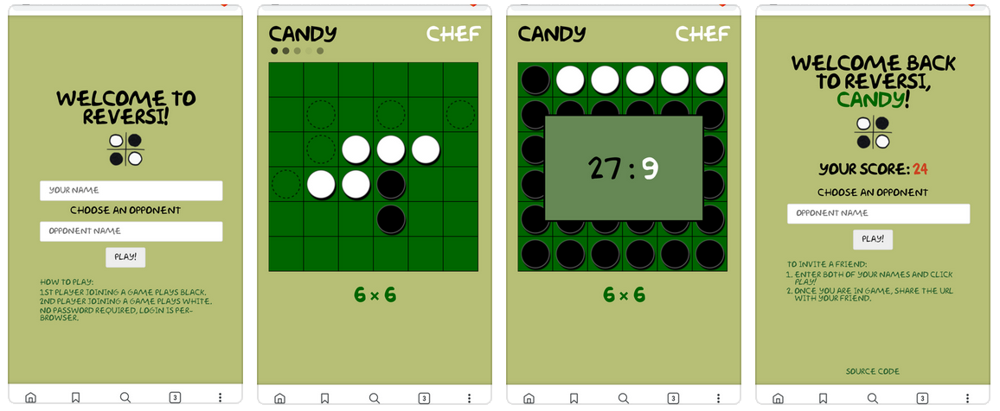
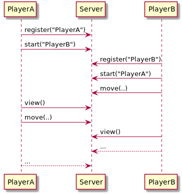

Among its various advantages, the [Internet Computer] enables a more simplified app development experience than conventional cloud computing platforms.
*Disclaimer:* I work for [DFINITY], the company that builds the Internet Computer.
But I'm also a software developer at heart, so I wanted to test this premise and evaluate the experience of building on the Internet Computer from the view point of a web developer.

I chose to build a version of [reversi], a strategy board game for two players -- not as a sample app, but as a real application complete with all of the bells and whistles that I imagine a multiplayer reversi game might have.



Before I dive into the technical details behind the scene, I'd like to focus on the high-level concept: a virtual environment where internet applications seamlessly connect to each other.
My personal belief is that with the evolution of cloud computing, infrastructure will become a commodity.
In other words, it no longer matters who who provides the infrastructure. What matters is:

> you write an application, and it runs on the internet.

# Programming Model

The experience of developing a web application on the Internet Computer is close to that of (the now defunct) [Parse] or [newer](https://en.wikipedia.org/wiki/Platform_as_a_service) [platforms](https://en.wikipedia.org/wiki/Function_as_a_service) of [a similar vein](https://en.wikipedia.org/wiki/Serverless_computing).
The basic premise of such a platform is to hide the complexity of building and maintaining backend services such as HTTP servers, databases, user logins, and so on.
Instead, they present an abstract virtual environment that just runs user applications, without users being aware of, or having to pay attention to, where and how their applications are run.

Looking at it from this perspective, the Internet Computer is both familiar and yet different.
The basic building block of an Internet Computer application is a [Canister], which conceptually is a live-running process that:
- is 100% deterministic (if all inputs and state are the same, the output must be the same);
- is transparently persisted (also called [Orthogonal Persistence]);
- communicates with users or other canisters via asynchronous messages (remote function calls);
- processes one message at a time (following the [Actor model]).

If we think of a [docker container] as virtualizing an entire operating system (OS), a canister virtualizes a single program, hiding almost all OS details.
This seems overly restrictive since it can't run your favorite OS or database.
*What good does it do?*

I personally prefer to think in terms of *disciplines* rather than *restrictions*.
Just to highlight two properties (out of many) that make the canister model distinct from the usual web services:
- **Atomicity**: Each update to the state of a canister is atomic per message (remote function call).  A call is either successful and state is updated, or it throws an error and the state is not touched (as if the call has never happened).
- **Bi-directional messaging**: A message is delivered at most once, and the message caller is always guaranteed a reply, either success or failure.

Such guarantees are hard to come by without restricting what a user program can do.
Hopefully by the end of reading this post, you'll agree with me that a restricted canister model actually accomplishes a lot by find the sweet spot between efficiency, robustness and simplicity.

# Client-server architecture

A multiplayer game requires exchanging data between players, the implementation of which often follows a client-server architecture:
- A server hosts the actual game and manages communication with game clients.
- Two or more clients, each representing a player, fetch state from server, render game UI, and also take player inputs to forward to the server.

Building a multiplayer game as a web application means the client has to run inside a browser, utilizing HTTP protocol for data communication and using Javascript (JS) to render game UI as a web page.

For this multiplayer reversi game, I want to implement the following functionalities:
- Any two players can choose to play a game against each other.
- Players gain points by winning a game, which also counts towards their accumulated scores.
- A score board shows the top players.
- And of course the usual game flow: taking inputs from each player in turn, enforcing only legal moves, and detecting the end of a game to count points.

Much of this game logic is about state manipulation, and a server side implementation helps to ensure that players can have a consistent view.

# Backend server

In a conventional backend setup, I will have to choose a suite of server-side software, including a database to keep player and game data, a web server that serves HTTP requests, and then write my own application software connecting to both to implement the full set of server-side logic. 

In a "serverless" setup, usually the web server and database services are already provided by the platform; I only need to write the application software calling into the platform to make use of these services.
Despite the misleading term "serverless", the application would still take the "server" role as prescribed by the client-server architecture.

Regardless of the backend setup, at the center of my application design is a set of APIs governing the communication between the game server and its clients.
Developing this application on the Internet Computer is no different.
So I started with the following high-level design on the game flow:



After players have registered, if any two of them indicate they want to play with each other (by the *start(opponent_name)* call), a new game will start.
Players then take turns to place their next moves, and the other player will have to periodically call *view()* to refresh its view on the newest game state, then make a next move and so on, until the game is over.
As a simple rule of thumb, a player is only allowed to play one game at any given time.

The server has to keep the following set of data:
- A list of registered players, their names and scores, etc.
- A list of ongoing games, with each including the latest game board, who is playing black/white, who is allowed to make next move, and the final result if it is finished, etc.

I chose to implement the server in [Motoko], but in theory, any language that compiles to [Wasm] can be made to work as long as it talks to the Internet Computer using the same set of system APIs.
As of writing, a Rust SDK is coming *Really Soon Now*.

Being a new language, Motoko has some rough edges (e.g. its [base library](https://github.com/dfinity/motoko-base) is a bit lacking and not yet stable), but it has already gained a [package manager](https://github.com/kritzcreek/vessel) and [language server protocol (LSP) support](https://marketplace.visualstudio.com/items?itemName=dfinity-foundation.vscode-motoko) in VSCode, which makes the development flow rather pleasant (so I heard, because I'm a Vim user).

I will not go into the Motoko language itself in this post. Instead, I'll discussion some notable features of Motoko and the Internet Computer that make canister development exciting.

## Stable variables

[Orthogonal Persistence] (OP) is not a new idea.
The new generation of computer hardware like [NVRam] has largely removed the barrier of persisting all program memory, and the access to external storage, such as a file system, becomes optional to a program.
However, one challenge often mentioned in OP literature is about upgrades, i.e., _What happens when an update has to change a program's data structure or memory layout?_

Motoko answers the question with **Stable Variables**.
They survive through upgrades, which in my case are ideal to hold player data because I don't want players to lose their accounts when I update the canister software.
(In a conventional server side development, I will have store player accounts in files or in databases -- which are an essential system service of "serverless" platforms.)
Only certain types of variables can be made stable, but besides that, they are just like any other variables that store data on heap, and can be used as such.

That said, there is currently a limitation preventing *HashMaps* from being used as stable variables, so I had to resort to arrays.
Here is an example:

```swift
// Instead of a list of player, use HashMap for faster lookup.
type Players = {
  id_map: HashMap.HashMap<PlayerId, PlayerState>;
  name_map: HashMap.HashMap<PlayerName, PlayerId>;
};

actor {
  // A stable data structure that holds player data.
  stable var accounts : [(PlayerId, PlayerState)] = [];

  // A more efficient data structure used by the rest of program.
  // It is initialized on the first canister install or on upgrades.
  // In other words, it is persisted, but does not survive upgrades.
  let players : Players = {
    id_map   = ... // build HashMap<PlayerId, PlayerState> from accounts
    name_map = ... // build HashMap<PlayerName, PlayerId> from accounts
  };

  // before upgrade, convert data from players to accounts.
  system func preupgrade() {
    accounts := Iter.toArray(players.id_map.entries());
  };
}
```

I hope that a future version of the [DFINITY SDK] will remove this limitation so that I can simply use *stable var players* without going through any conversion.

## User authentication

Every canister as well as every client (e.g., the *dfx* command line, or a browser) is given a **principal ID** that uniquely identifies them (For clients, such IDs are auto-generated from public/private keypairs, and DFINITY JS library manages them in a browser's local storage at the moment).
Motoko allows an canister to identify callers of "shared" functions and we can use them for authentication purposes.

For example, I define *register* and *view* functions as follows:

```swift
public shared (msg) func register(name: Text): async Result<PlayerView, RegistrationError> {
  let player_id = msg.caller;
  ...
}

public shared query (msg) func view() : async ?GameView {
  let player_id = msg.caller;
  ...
}
```
The expression *msg.caller* gives the principal ID of the caller of a message.
Note that this is different than the caller of a function.
In Motoko, incoming messages to an actor must be addressed to a *public* accessible function, which must have an *async* return type.
The above code shows two public functions: *register* and *view*, where the latter is a query call, as marked by the *query* keyword.

As we can see, accessing the message caller field must go through a special syntax:
either *shared (msg)* or *shared query (msg)*, where *msg* is a formal parameter that refers to the incoming message as a whole.
At the moment, the only attribute it has is *caller*.

Being able to access a unique ID of the caller (message sender) feels familiar, e.g., HTTP cookies.
But unlike HTTP, Internet Compute Protocol actually makes sure principal IDs are cryptographically secure and the user program running on the Internet Computer can fully trust their authenticity.

Personally, I think it is perhaps too powerful to let a program know its caller, and also too rigid (e.g. what happens when such IDs have to change?).
But for now, it does lead to a very simple authentication scheme that application developers can make use of.
I hope to see more development in this area.

## Concurrency and atomicity

Game clients may send messages to the game server at any time, so it's the server's responsibility to handle concurrent requests properly.
In a conventional architecture, I will have to build some logic to sequentialize player moves, usually through a messaging queue or a mutex/lock.

With the actor programming model employed by canisters, this is automatically taken care of, and I do not have to write any code for it.
Messages are just remote function calls, and a canister is guaranteed to only process one message at a time.
This leads to simplified programming logic -- I simply don't worry about functions being called concurrently.

Because canister state is only persisted after a message is fully processed (i.e., a public function call returns), I do not worry about flushing memory to disk, whether an exception can lead to corrupted on-disk state, or anything to do with reliability.
It should also be noted that the atomicity of persisting state changes is per message.
A public function is free to call any other non-async functions, and as long as the entire execution finishes without error, changed states are persisted (for update calls, more details is given below).
Finer granularity can be achieved by making async calls instead of sync calls, which become new messages to be scheduled by the system and not executed immediately.

If I were to build this game with a conventional architecture, I would probably choose an actor framework too, e.g., [Akka] for Java, [Actix] for Rust, and so on.
Motoko offers native actor support, joining the family of actor-based programming languages such as [Erlang] and [Pony].

## Update call vs. Query call

This is a feature that in my opinion really improves the user experience for Internet Computer applications.
It brings them on par with those hosted by conventional cloud platforms (or orders of magnitude faster when compared to other blockchains).

It is also a simple concept: any public function that does not need to change program state can be marked as a "query" call, otherwise it is regarded as an "update" call by default.

The difference between query and update is in both latency and concurrency:
- A query call may take only milliseconds to complete, compared to about two seconds for an update call.
- Query calls can be executed concurrently with good scalability; update calls are sequentialized (based on the actor model) and they offer atomicity guarantees.

As in the above code example, I was able to mark the *view* function as query call because it merely looks up and returns the state of the game that a player is playing.
In fact, most of the time we are doing query calls when we browse the Web:
data are retrieved from servers but not modified.

On the other hand, the *register* function above remains as an update call because it has to add a new player to the player list on a successful registration.
For many reasons like data consistency, atomicity, and reliability, update calls will take longer.
But it is not a problem that is inherent to the Internet Computer.
Many operations on the web today actually take more than two seconds to complete, e.g., making a credit card payment, placing a stock purchase order, or even logging into your bank account, just to name a few.
I think two seconds is at the borderline of a good user experience.

Coming back to the reversi game, when a player makes the next move, it has to be an update call too:

```swift
public shared (msg) func move(row: Int, col: Int) : async MoveResult { ...  }
```

If the game only refreshes its screen two seconds after a player has clicked the mouse (or touched the screen), it will feel unresponsive and no one will want to play a game that lags this much.
So I had to optimize this part by reacting to user inputs directly on the client side without having to wait for the server to respond.
This means the frontend UI will have to validate player's move, calculate what pieces would be flipped, and show them on screen immediately.
It also implies that whatever the frontend shows to the player will have to match server's response to the same move when it comes back, or we risk inconsistency.
But again, I believe any reasonable implementation of a multiplayer reversi or chess game would do the same, regardless of whether its backend takes 200 milliseconds to respond or two seconds.

# Frontend client

The DFINITY SDK provides a way to directly load an application's frontend in browsers.
It is not the same as a plain HTML page served from web servers, however; communication with backend canisters is via remote function calls, which in the case of a browser is overlaid on top of HTTP.
This is transparently handled by a [JS user library](https://www.npmjs.com/package/@dfinity/agent), so a JS programs only has to import a canister as if it is a JS object, and will be able to call its public functions as if they are regular async JS functions of the object.
The [DFINITY SDK] has a set of tutorials on how to setup a JS frontend, so I won't go into the details here.
Behind the scene, the *dfx* command from the SDK uses [Webpack] to package resources including JS, CSS, image, and other files you may have.
You can also combine your favorite JS framework such as [React], [AngularJS], [Vue.js], etc. with the DFINITY user library to develop a JS frontend for use in browser or in a mobile app.

## Main UI components

I'm relatively new to frontend development, having only had a brief experience with [React].
This time I took the liberty to learn [Mithril] since I've heard many good things about it, especially its simplicity.
To keep things simple, I also came up with a design that has only two screens: 

1. A *Play* screen that allows players to enter their name and the opponent's, before entering the Game screen.
   It will also show some tips and instructions, top player charts, recent players, and so on.
2. A *Game* screen that takes player inputs and communicates with the backend canister to render a reversi board.
   It will also show player scores at the end of game, which then leads player back to the Play screen.

The snippet below shows the skeleton of the game frontend in JS.

```javascript
import reversi from "ic:canisters/reversi";
import reversi_assets from "ic:canisters/reversi_assets";
import "./style.css";
import logo from "./logo.png";
import m from "mithril";

document.title = "Reversi Game on the Internet Computer";

function Game() { ... }

function Play() { ... }

m.route(document.body, "/play", {
  "/play": Play,
  "/game/:player/:against": Game
});
```

There are a couple things to note:

- The main backend canister *reversi* is imported just like any other JS library.
  It can be seen as a proxy that forwards function calls to the remote server, receives the replies, and transparently handles necessary authentication, message signing, data serialization/deserialization, error propagation, and so on.

- Another *reversi_assets* canister is also imported.
  This is a way to fetch necessary assets that were packed by [Webpack] when backend canisters were installed.
  In this case, I have a sound file that will be played when a player places a new piece.

- A *logo* image is also directly imported.
  This has to be configured in [Webpack] using *url-loader*, which essentially embeds the content of an image as a Base64 string to be used for an image element.
  Good for small images, but not big ones.

- The final application is setup using [Mithril] with two routes, */play* and */game*.
  The latter takes the player and opponent names as two parameters.
  This allows the game screen to be reloaded in browser without interrupting the game.

## Loading resources from the assets canister

This is something I struggled with a bit since I was not familiar with loading DOM elements asynchronously in JS.

When *dfx* builds canisters, it also builds a *reversi_assets* canister that basically just packs everything from <i>src/reversi_assets/assets/</i> in it.
I use it to retrieve a sound file, but to properly load it is not as direct as putting an URL to a mp3 file in the *src* field of a HTML element.
Here is how I load it (if you are a frontend developer, you may already know this):

```javascript
var putsound = null;

var start = function(...) {
  ...
  reversi_assets
    .retrieve("put.mp3")
    .then(function(array) {
      let buffer = new Uint8Array(array);
      var context = new AudioContext();
      context.decodeAudioData(buffer.buffer, function(res) {
        putsound = { buffer: res, context: context };
      });
    })
    .catch(function(err) {
      console.log("Asset retrieve error, ignore");
      console.log(err);
    });
  ...
}
```

When the start function is called (from an async context), it will try to retrieve the file *"put.mp3"* from the remote canister.
On a successful retrieval, it uses a JS facility *AudioContext* to decode the audio data and initialize the global variable *putsound*.

A call to *playAudio(putsound)* will play the actual sound if *putsound* has been properly initialized:

```javascript
function playAudio(sound) {
  if ("buffer" in sound) {
    var audioSource = sound.context.createBufferSource();
    audioSource.connect(sound.context.destination);
    audioSource.buffer = sound.buffer;
    if (audioSource.noteOn) {
      audioSource.noteOn(0);
    } else {
      audioSource.start();
    }
  }
}
```

Other resources can be loaded in a similar way.
I didn't use any image other than a logo, which is small enough to embed its source into Webpack
by adding the following configuration to *webpack.config.js*:

```javascript
  module: {
    rules: [
      ...
      { test: /\.png$/, use: ['url-loader'] },
    ]
    ...
  }
```

## Data exchange format

Motoko has a concept of "shareable" data, which means data that can be sent across canisters or language boundaries.
Obviously I wouldn't imagine a heap pointer in C being "shareable", but anything that can be mapped to JSON seems "shareable" to me.
For this purpose, DFINITY has developed an IDL (Interface Description Language) called [Candid] for Internet Computer applications.

Candid greatly simplifies how frontend talks to the backend, or how canisters talk to each other.
For example, the following is an (incomplete) snippet of the backend *reversi* canister as described by Candid:

```swift
type ColorCount = 
 record {
   "black": nat;
   "white": nat;
 };

type MoveResult = 
 variant {
   "GameNotFound";
   "GameNotStarted";
   "GameOver": ColorCount;
   "IllegalColor";
   "IllegalMove";
   "InvalidColor";
   "InvalidCoordinate";
   "OK";
   "Pass";
 };

service : {
  "list": () -> (ListResult) query;
  "move": (int, int) -> (MoveResult);
  "register": (text) -> (Result_2);
  "start": (text) -> (Result);
  "view": () -> (opt GameView) query;
}
```

Take the *move* method as an example:

* It is one of the methods exported under the *service* interface of the canister.
* It takes two integers as input (representing a coordinate), and returns a result of type *MoveResult*.
* *MoveResult* is a variant (aka enum) that represents possible results and errors when a player makes a move.
* Among the branches of *MoveResult*, *GameOver* indicates that a game has finished, and it carries an argument *ColorCount* representing the number of black and white pieces on the game board.

A candid file is automatically generated from Motoko source codes for each canister and automatically used by the JS user library, without any involvement from a developer:

* On the Motoko side, each candid type corresponds to a Motoko type, and each method corresponds to a public function.
* On the JS side, each candid type corresponds to a JSON object, and each method corresponds to a member function of the imported canister object.

Most candid types have direct JS representations, some require a little conversion.
For example, *nat* is arbitrary precision in both Motoko and Candid, and in JS it is mapped to a [bignumber.js] integer, so one has to use *n.toNumber()* to convert it to JS native number type.

One issue that I ran into was the *null* value in Candid (and Motoko's Option type).
It is represented in JSON as empty array *[]* instead of its native *null*.
This is to differentiate the cases when we have nested options, e.g. *Option<Option\<int\>>*:

|Motoko       |Rust         |JS           |
|-------------|-------------|-------------|
|?(?1)        |Some(Some(1))|[[1]]        |
|?(null)      |Some(None)   |[[]]         |
|null         |None         |[]           |

Candid is very powerful, although on the surface it may sound a lot like Protocolbuf, or JSON. So why is it necessary? There are some very good reasons besides what is covered here, and I encourage people who are interested in this topic to read the [Candid Spec].

## Synchronize game state with backend

As previously mentioned, I use a trick to immediately react to valid user inputs without having to wait for the backend game server to respond.
This means that the frontend only needs a confirmation from the game server (or rather, error handling if there is any) after the player makes a move.

Besides sending one's own move, a client will have to learn about the other player's move too.
This is achieved by periodically calling the *view()* function of the game canister hosted on the server side.

An implication of this design is that I had to repeat some of the same game logic in both backend (Motoko) and frontend (JS), which is not ideal.
Since Motoko compiles to Wasm, and Wasm can run in browsers, wouldn't it be nice if both frontend and backend can share the same Wasm module that implements core game logic?
This kind of sharing is only to share code but not state.
It may require some setup, but I think it is entirely possible.
I might give it a try in a future update.

Specifically for the reversi game, in certain conditions a player may be blocked from making any move, so the other player can make two consecutive moves or even more. 
In order to show every move a player makes, I chose to implement game state as a sequence of moves instead of just the latest state of the game board.
This also means by comparing the list of moves in the local state of frontend with what's returned by calling the *view()* function, we can easily know what has changed since a player made the last move, whose turn it is to make next move, and so on.

## SVG Animation 

The topic of doing animation with Scalable Vector Graphics (SVG) perhaps does not belong to this post, but at one point I was really stuck because of it.
So I'd like to share the lesson I've learned.

The problem I had was that animations would not start when I used the *repeatCount* setting to show them only once.
Most online resources on SVG only give example of \<animate\> that either repeats indefinitely or with a *repeatCount* setting.
They implicitly assumed that if an animation is to be shown once, it is started once the page is loaded (or with some delay setting).
But with most one-page app frameworks like [React] or [Mithril], the page is often not reloaded but merely re-rendered.
So when I wanted to show a game piece flipping from white to black or from black to white, it has to happen when the page re-renders, not when page reloads.
I was missing this crucial difference, and only figured it out after many failed tries.

So here is how I render an *animate* element (as a sub-element of SVG) using Mithril, where *rx* of an ellipse is changed from initial *radius* to *0* and back.

```javascript
m("animate", {
  attributeName: "rx",
  begin: "indefinite",
  dur: "0.4s",
  repeatCount: "1",
  values: [radius, radius, "0", radius].join(";"),
  fill: "freeze"
})
```

The explanation is as follows:

- *begin* is set to *indefinite* so that the animation can be manually controlled/started;
- *fill* is set to *freeze* to mean that after the animation finishes, its ending state will stay;
- *values* is set to 4 values, where first two are repeated as a trick to start animation after 0.1s (1/4 of *dur*) delay. This is because *begin* was already set to *indefinite*.

The main point is that animations should be started manually.
I use *setTimeout* to trigger it with 0s delay, which is a trick to wait until new UI elements prepared by Mithril are rendered in the browser DOM:

```javascript
setTimeout(function() {
  document.querySelectorAll("animate").forEach(function(animate) {
    if (!animate.id.startsWith("dot")) {
      animate.beginElement();
    }
  })}, 0)
```

The above says any *animate* elements with an id not starting with "dot" will be started now.

# Development workflow

I developed this game on Linux.
The initial setup involves installing the [DFINITY SDK] and following its instructions to create a project.
Later I find it tedious to remember all *dfx* command lines, so I made a [Makefile](https://github.com/ninegua/reversi/blob/master/Makefile) to help.

```
USAGE: make [PROVIDER=...] [install|reinstall|upgrade|clean|canister|assets]

Build & install instructions:

  install|reinstall|upgrade -- Build and install canisters with different mode.
  clean                     -- Remove build products.
  canister                  -- Only build the main canister
  assets                    -- Build both the main and assets canisters.

The PROVIDER variable is optional. It corresponds to "networks" configuration in
the dfx.json file. The default is "local".
```

Debugging and testing were mostly done in browser, so lots of *console.log()*.
There is actually a way to [write unit tests in Motoko](https://github.com/kritzcreek/motoko-matchers), but I only learned about it after I wrote the game.
Initially I also developed a terminal based frontend using Shell script and *dfx*.
I think it helped to speed up the debugging without having to go through browsers.
But of course, unit testing is a better way to ensure correctness.

# Play the game!

To actually run this game on the Internet Computer, there is now a [Tungsten network] that is open to third-party developers.
I encourage you to sign up, clone [this project]( https://github.com/ninegua/reversi), and deploy the game yourself to get a firsthand developer experience.

But non-developers cannot easily access applications on Tungsten because it is not yet public.
So I also hosted it myself using *dfx* and *nginx* as a reverse proxy so that I can invite friends to play.
I do not encourage people to do this on their own because the software is still at alpha stage.

A link to the actual game is given in the footer of this document, for demo purposes only.
My plan is to deploy it on the public Internet Computer network once it launches later this year.

Please feel free to visit the [project repository](https://github.com/ninegua/reversi) and submit issues if you have any questions.
Pull requests are also welcome!

Apply now for access to the Tungsten release of the Internet Computer at [dfinity.org/tungsten](https://dfinity.org/tungsten).

Join our developer community and start building at [forum.dfinity.org](https://forum.dfinity.org).

[Internet Computer]: https://dfinity.org
[DFINITY]: https://dfinity.org
[Parse]: https://en.wikipedia.org/wiki/Parse_(platform)
[Canister]: https://sdk.dfinity.org/docs/developers-guide/working-with-canisters.html
[Orthogonal Persistence]: https://sdk.dfinity.org/docs/language-guide/motoko.html#_orthogonal_persistence
[Actor model]: https://en.wikipedia.org/wiki/Actor_model
[docker container]: https://en.wikipedia.org/wiki/Docker_(software)
[DFINITY SDK]: https://sdk.dfinity.org/docs/index.html
[Motoko]: https://sdk.dfinity.org/docs/language-guide/motoko.html
[Wasm]: https://webassembly.org
[NVRam]: https://en.m.wikipedia.org/wiki/Non-volatile_random-access_memory
[Akka]: https:;/akka.io
[Actix]: https://actix.rs
[Erlang]: https://www.erlang.org
[Pony]: https://www.ponylang.io
[React]: https://reactjs.org
[AngularJS]: https://angularjs.org
[Vue.js]: https://vuejs.org
[Mithril]: https://mithril.js.org
[Webpack]: https://webpack.js.org
[Candid]: https://github.com/dfinity/candid
[Candid Spec]: https://github.com/dfinity/candid/blob/master/IDL.md
[bignumber.js]: https://github.com/MikeMcl/bignumber.js
[Tungsten network]: https://dfinity.org/tungsten
[reversi]: https://en.wikipedia.org/wiki/Reversi
